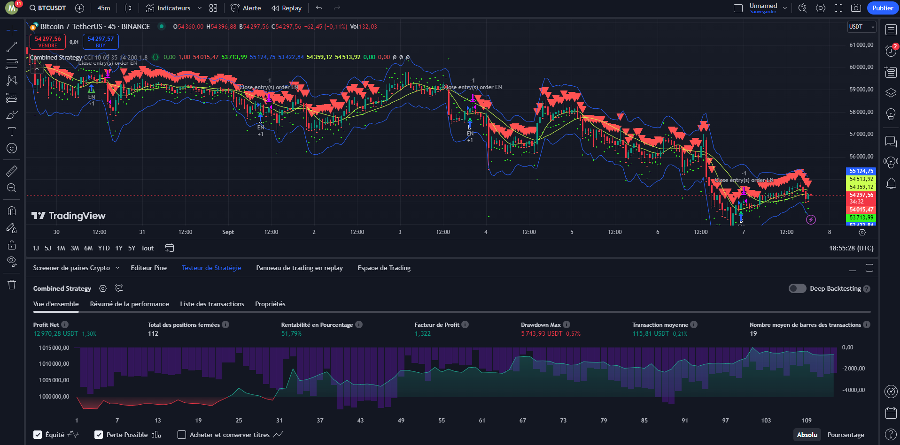

# Combined Strategy

This script implements a combined trading strategy using various technical indicators in Pine Script for TradingView.

## Overview

The strategy is a combination of three sub-strategies:
1. **ALMA Cross:** Uses ALMA (Arnaud Legoux Moving Average) to identify crossovers and determine the trend direction.
2. **Kokoabe rsistratV2:** Implements a strategy based on RSI (Relative Strength Index) and positive momentum.
3. **Alpha Trend Supertrend:** Utilizes Supertrend to identify trend conditions.

## Conditions for Buy and Sell Signals

The combined strategy generates buy and sell signals based on the following conditions:

- Buy Signal:
  - ALMA Cross: Upward trend and positive momentum.
  - Kokoabe rsistratV2: Conditions for entering a long position.
- Sell Signal:
  - ALMA Cross: Downward trend.
  - Kokoabe rsistratV2: Conditions for entering a short position.
  - Additional condition: Close price below a specific SMA (Simple Moving Average).

## Plotting

The script includes visualizations for buy and sell signals, trend lines, and various indicator values.

## Additional Features

The script provides additional features such as:
- Entry signals based on CCI (Commodity Channel Index) or Momentum.
- Detection of regular bullish/bearish divergence.
- Mean Reversion Bands.
- Cumulative Volume Delta (CVD) analysis.

## Usage

To use this script on TradingView:
1. Copy the code.
2. Open TradingView's Pine Editor.
3. Paste the code and save the script.
4. Apply the script to your chart.

## Settings and Customization

The script includes various input settings that allow you to customize the strategy parameters, including the length of moving averages, RSI levels, and more.

### Calculation Settings

- **Volume Delta Calculation:** Choose between different methods for calculating volume delta.
- **Lower Timeframe Precision:** Adjust the precision of the lower timeframe.

### Presentation Settings

- **Volume Delta:** Choose the type of volume delta display.
- **Cumulative Volume Delta:** Configure the presentation of cumulative volume delta.
- **Volume Delta/Price Bar Divergences:** Enable detection of divergences between volume delta and price bars.

### Other Features

- **Volume MA:** Toggle the visibility of the average volume over a selected period.
- **CVD Smoothing:** Toggle the visibility of the smoothing line for cumulative volume delta.
- **Entry Signal Alerts:** Receive alerts for buy and sell signals.

## Disclaimer

This script is provided for educational and informational purposes only. Trading involves risks, and past performance is not indicative of future results. Use this script at your own discretion.

## Testing on tradingview 

